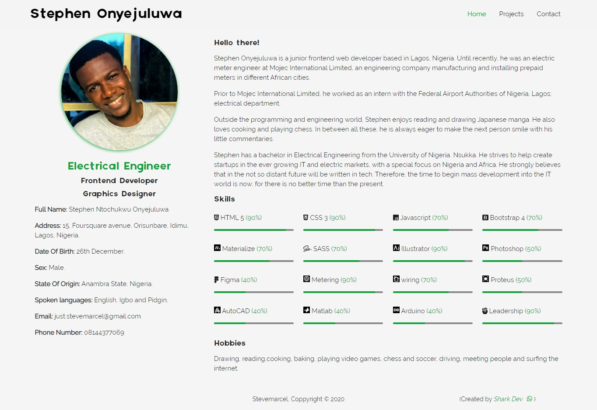
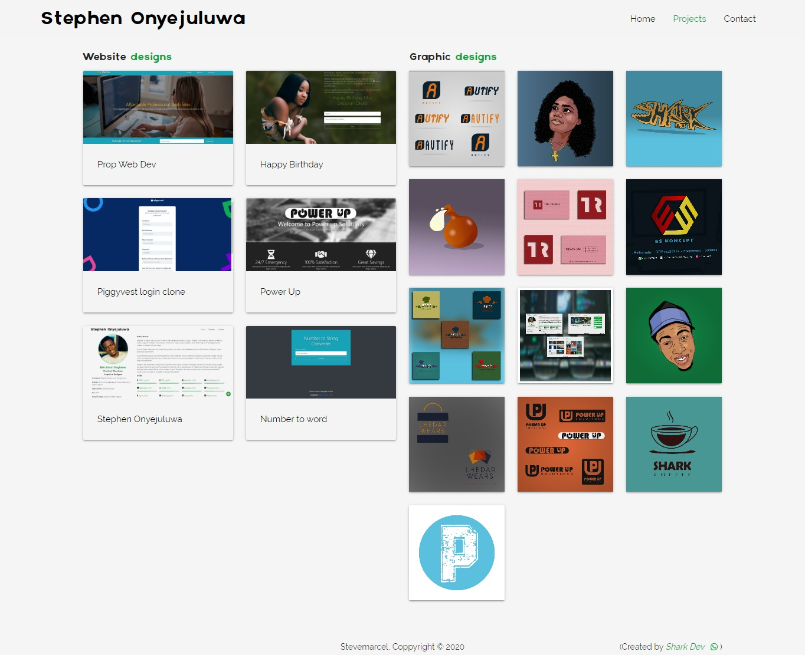
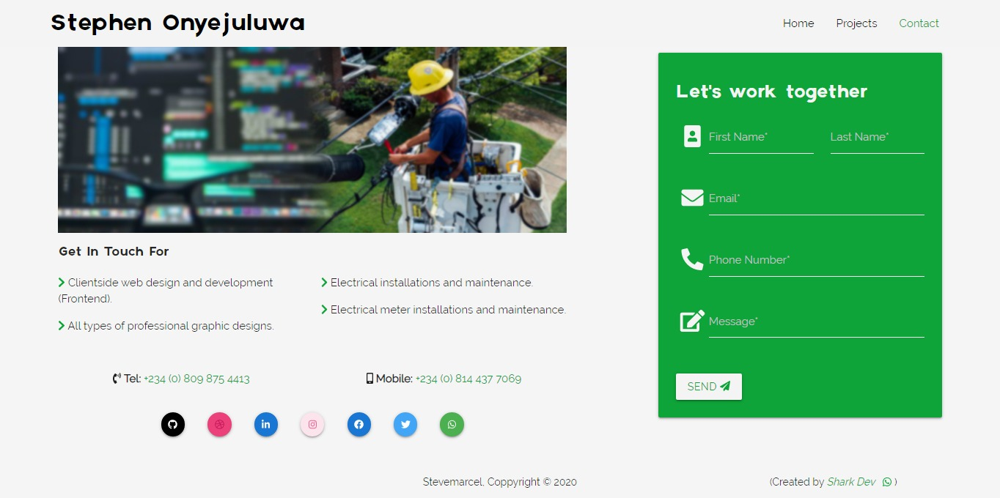
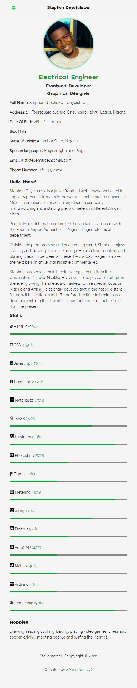
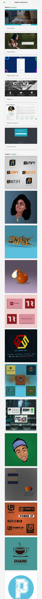
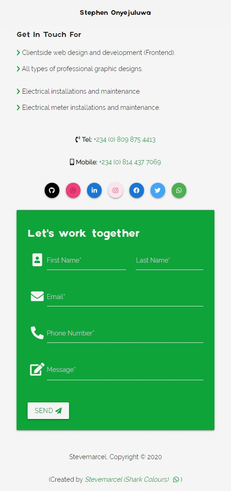

# personal_profile

My personal profile page. This site was built using different methods. Each method is seperated into different branches as:

(1) flexbox branch.

(2) gridbox branch.

(3) [materializecss](http://materializecss.com) branch.

The name of each branch specifies the method used in creating them. This website is fully responsive on all screens.

## Page layout design

### Desktop view of home page

### Desktop view of projects page

### Desktop view of contact page

### Mobile view of home page

### Mobile view of project page

### Mobile view of contact page

## Author

[stevemarcel](https://github.com/stevemarcel), the shark dev.
